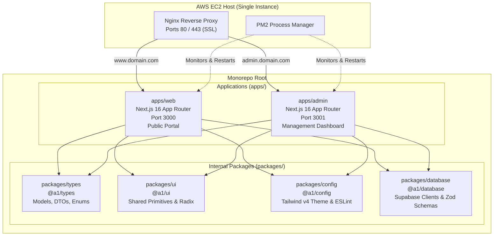
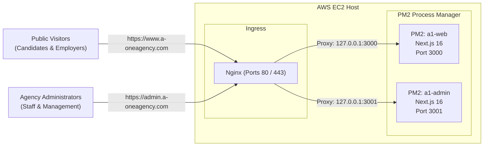

# Architectural Migration Plan: Single-App to Monorepo Architecture

> **Document Version:** 1.0.0  
> **Target Framework:** Next.js 16+ App Router, Turborepo / NPM Workspaces, Tailwind CSS v4, AWS EC2, PM2, Nginx  
> **Domain Target:** `www.a-oneagency.com` (Public Web) & `admin.a-oneagency.com` (Admin Dashboard)

---

## Executive Summary

This specification provides the end-to-end architectural blueprint for decomposing the existing unified Next.js App Router codebase (`a1-agency-website`) into a high-performance **Monorepo**. 

The migration separates the public-facing candidate/employer portal (`apps/web`) from the internal agency management dashboard (`apps/admin`) while centralizing common business logic, data models, Zod validation schemas, UI primitives, and design tokens inside shared packages (`packages/types`, `packages/ui`, `packages/config`, `packages/database`).



---

## 1. Architectural Analysis

### 1.1 Preventing Code Duplication Across Workspace Boundaries

In the current monolithic structure, the repository relies on root-relative path aliases (e.g., `@/components/common`, `@/types`). When splitting into two independent Next.js runtime applications, naive copying would lead to diverging schemas, inconsistent UI behavior, and doubled maintenance cost. 

A monorepo solves this using **npm/pnpm workspaces** combined with **Turborepo** task orchestration:

1. **`packages/types` (`@a1/types`)**:
   * **Scope:** Houses all canonical TypeScript interfaces currently residing in `src/types/index.ts` (`JobPosting`, `Applicant`, `EmployerRequest`, `Country`, `Category`, `Review`, `Announcement`, `EventItem`, `FAQItem`, `ContactMessage`, `StaffProfile`).
   * **Mechanism:** Exported as pure TypeScript source modules via package `exports`. Next.js leverages `transpilePackages` to compile them alongside each app's build, eliminating separate build-step latency in development.
   * **Benefit:** When a database column is added (e.g., `slbfe_approval_number` or `passport_expiry_date`), updating a single type definition enforces immediate type-safety in both the admin management forms and the public display cards.

2. **`packages/ui` (`@a1/ui`)**:
   * **Scope:** Common non-domain design primitives: `Breadcrumbs.tsx`, `EmptyState.tsx`, `SectionHeading.tsx`, Radix UI wrappers (`Dialog`, `Select`, `Toast`, `Accordion`), and utility styling functions (`cn()`, `clsx`, `tailwind-merge`).
   * **Mechanism:** Consumed as workspace packages (`"@a1/ui": "*"`). Domain-specific components (e.g., `HeroSection.tsx` for web, or `Sidebar.tsx` / `StatCard.tsx` for admin) remain localized within their respective application directories (`apps/web/src/components` and `apps/admin/src/components`).

3. **`packages/config` (`@a1/config`) & Tailwind CSS v4 Theme Standardization**:
   * **Scope:** Standardizes the design system tokens, typography, and color scales across all web surfaces.
   * **Mechanism:** Tailwind CSS v4 replaces legacy `tailwind.config.js` with CSS-first configuration via `@theme` blocks. We extract the design tokens (Brand Gold `#f4c300`, Navy 950–50 palette, Slate, Teal, Amber scales, custom shadows, and font families) into `packages/config/tailwind/theme.css`. Both `apps/web/src/app/globals.css` and `apps/admin/src/app/globals.css` import this shared theme file:
     ```css
     @import "tailwindcss";
     @import "@a1/config/tailwind/theme.css";
     ```
   * **Benefit:** Absolute visual consistency across public and administrative subdomains without duplicating 300+ lines of CSS variables.

4. **`packages/database` (`@a1/database`)**:
   * **Scope:** Supabase client factory functions (`createBrowserClient`, `createServerActionClient`), database type definitions, and shared Zod schemas (`jobSchema`, `applicationSchema`, `contactMessageSchema`).
   * **Benefit:** Both apps execute validation against the exact same rules. The public application validates inputs before submission; the admin dashboard validates them during administrative editing and updates.

---

### 1.2 Monorepo vs. Route Groups `(admin)` / `(public)` on AWS EC2

| Evaluation Vector | Single Next.js App with Route Groups | Monorepo (`apps/web` + `apps/admin`) | Architectural Verdict |
| :--- | :--- | :--- | :--- |
| **Blast Radius & Reliability** | **High Risk:** A fatal unhandled rejection, memory leak in admin file export, or infinite loop crashes the single Node.js runtime, taking down the public recruitment portal. | **Isolated:** `apps/web` and `apps/admin` run as completely segregated OS processes. An out-of-memory error in Admin leaves Web 100% operational. | **Winner: Monorepo** |
| **Independent Deployments** | **Coupled:** Any minor patch or bug fix in an admin dashboard table requires rebuilding and redeploying the entire website bundle. | **Decoupled:** Continuous deployment pipelines build and reload only the affected app (`npx turbo run build --filter=admin`). Web users experience zero interruptions. | **Winner: Monorepo** |
| **Security & Attack Surface** | **Shared Surface:** Admin API endpoints and routes sit on the same origin/host. Middleware bugs could expose administrative paths to public crawlers. Auth cookies share host scope unless strictly isolated. | **Hardened:** `admin.domain.com` is routed to an isolated port. Nginx can enforce IP whitelisting, VPN-only access, rate limiting, and distinct WAF rules on the admin block without impacting public visitors. | **Winner: Monorepo** |
| **EC2 Hardware Footprint** | **Lower Memory Baseline:** 1 Node.js process consumes ~150MB–280MB RAM idle (~450MB under peak production traffic). | **Higher Memory Baseline:** 2 distinct Node.js runtimes require ~300MB–550MB RAM combined idle, scaling to ~800MB–1.2GB during concurrent operations. | **Winner: Single App** *(Requires t3.small/medium)* |
| **Build & CI/CD Overhead** | **Simple:** Single `npm run build` command; straightforward cache. | **Moderate:** Requires workspace orchestration (Turborepo), pipeline dependency graph caching, and scoped deployment commands. | **Winner: Single App** |
| **Domain & Cookie Scoping** | **Complex:** Authentication cookies must be scoped precisely to avoid passing admin session tokens to public CDN edge caches or static pages. | **Clean:** Cookies are natively isolated to `admin.domain.com` or explicitly partitioned using domain attribute controls. | **Winner: Monorepo** |

> **Architectural Conclusion:** For a mission-critical commercial recruitment agency handling SLBFE-regulated candidate data, overseas employer contracts, and real-time job applications, the security isolation and operational independence of a **Monorepo** overwhelmingly outweigh the modest additional memory requirement on EC2.

---

## 2. Proposed Directory Structure

Below is the definitive monorepo workspace tree:

```
a1-agency-monorepo/
├── .github/
│   └── workflows/
│       ├── deploy-web.yml               # Triggered only on changes in apps/web or packages/
│       └── deploy-admin.yml             # Triggered only on changes in apps/admin or packages/
├── apps/
│   ├── web/                             # Public Portal Application (Port 3000)
│   │   ├── public/                      # Static assets: agency logos, hero banners, partner logos
│   │   ├── src/
│   │   │   ├── app/
│   │   │   │   ├── (marketing)/
│   │   │   │   │   ├── about/page.tsx
│   │   │   │   │   ├── contact/page.tsx
│   │   │   │   │   ├── employers/page.tsx
│   │   │   │   │   ├── faq/page.tsx
│   │   │   │   │   ├── how-it-works/page.tsx
│   │   │   │   │   ├── privacy-policy/page.tsx
│   │   │   │   │   └── terms/page.tsx
│   │   │   │   ├── countries/
│   │   │   │   │   ├── [slug]/page.tsx
│   │   │   │   │   └── page.tsx
│   │   │   │   ├── job-categories/
│   │   │   │   │   ├── [slug]/page.tsx
│   │   │   │   │   └── page.tsx
│   │   │   │   ├── jobs/
│   │   │   │   │   ├── [id]/page.tsx
│   │   │   │   │   └── page.tsx
│   │   │   │   ├── error.tsx
│   │   │   │   ├── globals.css          # Imports Tailwind + @a1/config/tailwind/theme.css
│   │   │   │   ├── layout.tsx           # Public header, footer, WhatsApp floating button
│   │   │   │   ├── not-found.tsx
│   │   │   │   ├── page.tsx             # Public landing page
│   │   │   │   ├── robots.ts
│   │   │   │   └── sitemap.ts
│   │   │   ├── components/
│   │   │   │   ├── forms/               # Public candidate ApplicationForm, ContactForm, EmployerRequestForm
│   │   │   │   ├── home/                # HeroSection, FeaturedJobs, Testimonials, Statistics, etc.
│   │   │   │   ├── jobs/                # JobCard, JobFilters, JobsPageClient, ShareJobButton
│   │   │   │   └── layout/              # Header, Footer, MobileNav, WhatsAppButton
│   │   │   └── config/                  # site.ts, navigation links, marketing metadata
│   │   ├── next.config.ts
│   │   ├── package.json                 # Name: "@a1/web"
│   │   └── tsconfig.json
│   │
│   └── admin/                           # Admin Dashboard Application (Port 3001)
│       ├── public/                      # Admin-specific assets, icons, badge SVGs
│       ├── src/
│       │   ├── app/
│       │   │   ├── announcements/       # Notice board & emergency alerts CRUD
│       │   │   ├── applicants/          # SLBFE candidate pipeline & stage progression
│       │   │   ├── contact-messages/    # Inbound inquiries inbox
│       │   │   ├── dashboard/           # Metrics, analytics, operational overview
│       │   │   ├── employer-requests/   # Manpower demand orders & status
│       │   │   ├── events/              # Interview dates & recruitment drives
│       │   │   ├── faqs/                # FAQ taxonomy manager
│       │   │   ├── jobs/                # Job vacancy postings & approvals
│       │   │   ├── login/               # Isolated admin credentials authentication
│       │   │   ├── media/               # Deployment photos & video gallery management
│       │   │   ├── reviews/             # Moderation queue for candidate feedback
│       │   │   ├── taxonomy/
│       │   │   │   ├── categories/page.tsx
│       │   │   │   └── countries/page.tsx
│       │   │   ├── team/                # Leadership & counselor profile management
│       │   │   ├── globals.css          # Imports Tailwind + @a1/config/tailwind/theme.css
│       │   │   ├── layout.tsx           # Admin shell (Sidebar + Topbar + Auth boundary)
│       │   │   ├── middleware.ts        # RBAC and session token validation
│       │   │   └── page.tsx             # Redirects to /dashboard
│       │   ├── components/
│       │   │   ├── layout/              # Sidebar.tsx, Topbar.tsx, AdminBreadcrumbs.tsx
│       │   │   └── ui/                  # StatCard, DataTable, StatusBadge, ActionButton
│       │   └── lib/                     # Admin-specific helpers, audit logging utilities
│       ├── next.config.ts
│       ├── package.json                 # Name: "@a1/admin"
│       └── tsconfig.json
│
├── packages/
│   ├── types/                           # @a1/types
│   │   ├── src/
│   │   │   ├── models/                  # jobs.ts, applicants.ts, taxonomy.ts, etc.
│   │   │   └── index.ts                 # Single barrel export
│   │   ├── package.json
│   │   └── tsconfig.json
│   │
│   ├── ui/                              # @a1/ui
│   │   ├── src/
│   │   │   ├── common/                  # Breadcrumbs.tsx, EmptyState.tsx, SectionHeading.tsx
│   │   │   ├── primitives/              # Button, Dialog, Select, Badge, Toast, Separator
│   │   │   ├── utils/                   # cn.ts (clsx + tailwind-merge helper)
│   │   │   └── index.ts
│   │   ├── package.json
│   │   └── tsconfig.json
│   │
│   ├── config/                          # @a1/config
│   │   ├── tailwind/
│   │   │   └── theme.css                # Canonical Tailwind CSS v4 @theme design tokens
│   │   ├── typescript/
│   │   │   ├── base.json
│   │   │   └── nextjs.json
│   │   ├── eslint/
│   │   │   └── base.js
│   │   └── package.json
│   │
│   └── database/                        # @a1/database
│       ├── src/
│       │   ├── client.ts                # Supabase browser singleton
│       │   ├── server.ts                # Supabase SSR / Server Action authenticated client
│       │   ├── schemas/                 # Zod validation schemas for all entities
│       │   │   ├── job.schema.ts
│       │   │   ├── applicant.schema.ts
│       │   │   └── contact.schema.ts
│       │   └── index.ts
│       ├── package.json
│       └── tsconfig.json
│
├── .gitignore
├── ecosystem.config.js                  # Production PM2 cluster/process definitions
├── package.json                         # Monorepo root package.json (workspaces)
├── turbo.json                           # Turborepo task pipeline definition
└── README.md
```

---

## 3. Step-by-Step Execution Plan

### Step 1: Workspace Initialization and Root Configuration

#### 1.1 Root `package.json` Setup
Initialize the root workspace. In the project root, configure npm workspaces and development dependencies:

```json
{
  "name": "a1-agency-monorepo",
  "version": "1.0.0",
  "private": true,
  "workspaces": [
    "apps/*",
    "packages/*"
  ],
  "scripts": {
    "dev": "turbo run dev",
    "dev:web": "turbo run dev --filter=@a1/web",
    "dev:admin": "turbo run dev --filter=@a1/admin",
    "build": "turbo run build",
    "build:web": "turbo run build --filter=@a1/web",
    "build:admin": "turbo run build --filter=@a1/admin",
    "lint": "turbo run lint",
    "type-check": "turbo run type-check",
    "clean": "turbo run clean && rm -rf node_modules"
  },
  "devDependencies": {
    "turbo": "^2.4.0",
    "typescript": "^5.7.0",
    "prettier": "^3.5.0",
    "eslint": "^9.0.0"
  },
  "engines": {
    "node": ">=20.0.0",
    "npm": ">=10.0.0"
  }
}
```

#### 1.2 Turborepo Pipeline Configuration (`turbo.json`)
Create `turbo.json` at the root to declare task dependencies, caching rules, and environment variable passthrough:

```json
{
  "$schema": "https://turbo.build/schema.json",
  "ui": "tui",
  "tasks": {
    "build": {
      "dependsOn": ["^build"],
      "inputs": ["$TURBO_DEFAULT$", ".env*", "!**/*.md"],
      "outputs": [".next/**", "!.next/cache/**", "dist/**"],
      "env": [
        "NODE_ENV",
        "NEXT_PUBLIC_SUPABASE_URL",
        "NEXT_PUBLIC_SUPABASE_ANON_KEY",
        "SUPABASE_SERVICE_ROLE_KEY",
        "NEXT_PUBLIC_SITE_URL",
        "NEXT_PUBLIC_ADMIN_URL"
      ]
    },
    "type-check": {
      "dependsOn": ["^build"]
    },
    "lint": {
      "dependsOn": ["^build"]
    },
    "dev": {
      "cache": false,
      "persistent": true
    },
    "clean": {
      "cache": false
    }
  }
}
```

---

### Step 2: Shared Packages Extraction & Tailwind v4 Theme Standardization

#### 2.1 Package: `@a1/types` (`packages/types`)
Create `packages/types/package.json`:
```json
{
  "name": "@a1/types",
  "version": "1.0.0",
  "private": true,
  "main": "./src/index.ts",
  "types": "./src/index.ts",
  "exports": {
    ".": "./src/index.ts"
  },
  "devDependencies": {
    "typescript": "^5.7.0"
  }
}
```
Migrate the current `src/types/index.ts` contents directly into `packages/types/src/index.ts`.

#### 2.2 Package: `@a1/config` (`packages/config`)
Standardize Tailwind CSS v4 design tokens into `packages/config/tailwind/theme.css`:

```css
/* packages/config/tailwind/theme.css */
@theme {
  /* ── Agency Brand Identity ───────────────────────────────────────────────── */
  --color-brand-black: #000000;
  --color-brand-gold: #f4c300;
  --color-brand-white: #ffffff;

  /* ── Deep Executive Navy ─────────────────────────────────────────────────── */
  --color-navy-950: #0a1628;
  --color-navy-900: #0f1f3d;
  --color-navy-800: #162447;
  --color-navy-700: #1d3461;
  --color-navy-600: #234180;
  --color-navy-500: #2d5096;
  --color-navy-400: #4a73c4;
  --color-navy-300: #7198d8;
  --color-navy-200: #a3bbea;
  --color-navy-100: #d0dff4;
  --color-navy-50:  #eaf0fb;

  /* ── Teal (Placement & Verified Status) ─────────────────────────────────── */
  --color-teal-700: #0f766e;
  --color-teal-600: #0d9488;
  --color-teal-500: #14b8a6;
  --color-teal-100: #ccfbf1;
  --color-teal-50:  #f0fdfa;

  /* ── Amber (SLBFE Approvals & Pending Alerts) ───────────────────────────── */
  --color-amber-600: #d97706;
  --color-amber-500: #f59e0b;
  --color-amber-100: #fef3c7;
  --color-amber-50:  #fffbeb;

  /* ── Slate Scale ────────────────────────────────────────────────────────── */
  --color-slate-900: #0f172a;
  --color-slate-800: #1e293b;
  --color-slate-700: #334155;
  --color-slate-600: #475569;
  --color-slate-500: #64748b;
  --color-slate-400: #94a3b8;
  --color-slate-300: #cbd5e1;
  --color-slate-200: #e2e8f0;
  --color-slate-100: #f1f5f9;
  --color-slate-50:  #f8fafc;

  /* ── Typography & Elevation ────────────────────────────────────────────── */
  --font-sans: "Inter", "Segoe UI", system-ui, sans-serif;
  --font-display: "Inter", "Segoe UI", system-ui, sans-serif;

  --radius-sm: 0.375rem;
  --radius-md: 0.5rem;
  --radius-lg: 0.75rem;
  --radius-xl: 1rem;
  --radius-2xl: 1.25rem;

  --shadow-card: 0 1px 3px 0 rgb(0 0 0 / 0.07), 0 1px 2px -1px rgb(0 0 0 / 0.07);
  --shadow-card-hover: 0 10px 25px -5px rgb(0 0 0 / 0.1), 0 8px 10px -6px rgb(0 0 0 / 0.1);
}
```

Create `packages/config/package.json`:
```json
{
  "name": "@a1/config",
  "version": "1.0.0",
  "private": true,
  "exports": {
    "./tailwind/theme.css": "./tailwind/theme.css",
    "./typescript/base.json": "./typescript/base.json",
    "./typescript/nextjs.json": "./typescript/nextjs.json"
  }
}
```

#### 2.3 Package: `@a1/ui` (`packages/ui`)
Create `packages/ui/package.json`:
```json
{
  "name": "@a1/ui",
  "version": "1.0.0",
  "private": true,
  "main": "./src/index.ts",
  "types": "./src/index.ts",
  "exports": {
    ".": "./src/index.ts"
  },
  "dependencies": {
    "clsx": "^2.1.1",
    "tailwind-merge": "^3.0.0",
    "lucide-react": "^1.34.0",
    "@radix-ui/react-slot": "^1.1.0",
    "@radix-ui/react-dialog": "^1.1.0",
    "@radix-ui/react-select": "^2.1.0",
    "@radix-ui/react-toast": "^1.2.0"
  },
  "peerDependencies": {
    "react": "^19.0.0",
    "react-dom": "^19.0.0"
  }
}
```

Create `packages/ui/src/utils/cn.ts`:
```typescript
import { clsx, type ClassValue } from "clsx";
import { twMerge } from "tailwind-merge";

export function cn(...inputs: ClassValue[]): string {
  return twMerge(clsx(inputs));
}
```

Export shared components (`Breadcrumbs`, `EmptyState`, `SectionHeading`) from `packages/ui/src/index.ts`:
```typescript
export * from "./utils/cn";
export * from "./common/Breadcrumbs";
export * from "./common/EmptyState";
export * from "./common/SectionHeading";
```

#### 2.4 Package: `@a1/database` (`packages/database`)
Isolate Supabase client initializers and Zod schemas into `packages/database`.
```json
{
  "name": "@a1/database",
  "version": "1.0.0",
  "private": true,
  "main": "./src/index.ts",
  "types": "./src/index.ts",
  "exports": {
    ".": "./src/index.ts"
  },
  "dependencies": {
    "@supabase/supabase-js": "^2.49.0",
    "@supabase/ssr": "^0.5.0",
    "zod": "^3.24.0"
  }
}
```

---

### Step 3: Migration of the Public Website (`apps/web`)

#### 3.1 App Configuration (`apps/web/package.json`)
```json
{
  "name": "@a1/web",
  "version": "1.0.0",
  "private": true,
  "scripts": {
    "dev": "next dev -p 3000",
    "build": "next build",
    "start": "next start -p 3000",
    "lint": "eslint",
    "type-check": "tsc --noEmit"
  },
  "dependencies": {
    "@a1/config": "*",
    "@a1/database": "*",
    "@a1/types": "*",
    "@a1/ui": "*",
    "@hookform/resolvers": "^3.9.0",
    "lucide-react": "^1.34.0",
    "next": "16.3.3",
    "react": "19.2.8",
    "react-dom": "19.2.8",
    "react-hook-form": "^7.54.0",
    "zod": "^3.24.0"
  },
  "devDependencies": {
    "@tailwindcss/postcss": "^4",
    "@types/node": "^20",
    "@types/react": "^19",
    "@types/react-dom": "^19",
    "tailwindcss": "^4",
    "typescript": "^5"
  }
}
```

#### 3.2 Transpilation Configuration (`apps/web/next.config.ts`)
Enable transparent workspace transpilation so TypeScript modules from `packages/` compile seamlessly:

```typescript
import type { NextConfig } from "next";

const nextConfig: NextConfig = {
  transpilePackages: ["@a1/types", "@a1/ui", "@a1/database", "@a1/config"],
  images: {
    remotePatterns: [
      { protocol: "https", hostname: "images.unsplash.com" },
      { protocol: "https", hostname: "*.supabase.co" },
    ],
  },
};

export default nextConfig;
```

#### 3.3 CSS Stylesheet Configuration (`apps/web/src/app/globals.css`)
```css
@import "tailwindcss";
@import "@a1/config/tailwind/theme.css";

/* App-specific web layout utilities and interactive animations */
@layer base {
  body {
    background-color: var(--color-brand-white);
    color: var(--color-slate-900);
    font-family: var(--font-sans);
  }
}
```

#### 3.4 File Migration Routing
* Move `src/app/(admin)` completely out of `apps/web`.
* Retain all candidate-facing routes:
  `page.tsx` (Homepage), `about/`, `contact/`, `countries/`, `employers/`, `faq/`, `how-it-works/`, `job-categories/`, `jobs/`, `privacy-policy/`, `terms/`, `robots.ts`, `sitemap.ts`.
* Relocate `src/components/home`, `src/components/jobs`, `src/components/layout`, and `src/components/forms` into `apps/web/src/components/`.

---

### Step 4: Scaffolding the Admin Dashboard (`apps/admin`)

#### 4.1 App Configuration (`apps/admin/package.json`)
```json
{
  "name": "@a1/admin",
  "version": "1.0.0",
  "private": true,
  "scripts": {
    "dev": "next dev -p 3001",
    "build": "next build",
    "start": "next start -p 3001",
    "lint": "eslint",
    "type-check": "tsc --noEmit"
  },
  "dependencies": {
    "@a1/config": "*",
    "@a1/database": "*",
    "@a1/types": "*",
    "@a1/ui": "*",
    "@hookform/resolvers": "^3.9.0",
    "lucide-react": "^1.34.0",
    "next": "16.3.3",
    "react": "19.2.8",
    "react-dom": "19.2.8",
    "react-hook-form": "^7.54.0",
    "zod": "^3.24.0"
  },
  "devDependencies": {
    "@tailwindcss/postcss": "^4",
    "@types/node": "^20",
    "@types/react": "^19",
    "@types/react-dom": "^19",
    "tailwindcss": "^4",
    "typescript": "^5"
  }
}
```

#### 4.2 Route Flattening
Because `apps/admin` is hosted exclusively on `admin.a-oneagency.com`, the redundant `/admin` prefix is stripped from the URL path structure:

| Previous Monolithic Path | New Subdomain Path (`admin.a-oneagency.com`) | Target Component File |
| :--- | :--- | :--- |
| `/admin` | `/` (Redirect to `/dashboard`) | `apps/admin/src/app/page.tsx` |
| `/admin/dashboard` | `/dashboard` | `apps/admin/src/app/dashboard/page.tsx` |
| `/admin/jobs` | `/jobs` | `apps/admin/src/app/jobs/page.tsx` |
| `/admin/applicants` | `/applicants` | `apps/admin/src/app/applicants/page.tsx` |
| `/admin/employer-requests` | `/employer-requests` | `apps/admin/src/app/employer-requests/page.tsx` |
| `/admin/taxonomy/countries` | `/taxonomy/countries` | `apps/admin/src/app/taxonomy/countries/page.tsx` |
| `/admin/reviews` | `/reviews` | `apps/admin/src/app/reviews/page.tsx` |
| `/admin/announcements` | `/announcements` | `apps/admin/src/app/announcements/page.tsx` |
| `/admin/login` | `/login` | `apps/admin/src/app/login/page.tsx` |

#### 4.3 Isolated Authentication Boundary (`apps/admin/src/middleware.ts`)
Create a dedicated Next.js middleware running exclusively inside `apps/admin`. Public traffic to `apps/web` never incurs the latency overhead of admin auth checks:

```typescript
import { NextResponse, type NextRequest } from "next/server";

export async function middleware(request: NextRequest) {
  const { pathname } = request.nextUrl;

  // Bypass public static assets and the login screen
  if (
    pathname.startsWith("/_next") ||
    pathname.startsWith("/api/auth") ||
    pathname === "/login" ||
    pathname.includes(".")
  ) {
    return NextResponse.next();
  }

  // Inspect the administrative session token
  const token = request.cookies.get("sb-access-token")?.value;

  if (!token) {
    const loginUrl = new URL("/login", request.url);
    loginUrl.searchParams.set("from", pathname);
    return NextResponse.redirect(loginUrl);
  }

  return NextResponse.next();
}

export const config = {
  matcher: ["/((?!_next/static|_next/image|favicon.ico).*)"],
};
```

---

## 4. AWS EC2 Production Deployment Strategy



### 4.1 EC2 Instance Sizing & System Preparation

#### Recommended Instance Type
* **Minimum viable:** `t3.small` (2 vCPUs, 2 GB RAM). *Requires 2 GB swap space to prevent out-of-memory errors during concurrent Next.js builds.*
* **Production Recommended:** `t3.medium` (2 vCPUs, 4 GB RAM) or `t4g.medium` (AWS Graviton, 2 vCPUs, 4 GB RAM) for higher build throughput and concurrent traffic tolerance.
* **Storage:** 30 GB gp3 EBS Volume.
* **OS:** Ubuntu 24.04 LTS.

#### Swap Space Setup (Mandatory for <4 GB instances)
```bash
sudo fallocate -l 2G /swapfile
sudo chmod 600 /swapfile
sudo mkswap /swapfile
sudo swapon /swapfile
echo '/swapfile none swap sw 0 0' | sudo tee -a /etc/fstab
```

---

### 4.2 Process Management with PM2

#### Configuration File: `ecosystem.config.js`
Place `ecosystem.config.js` in the monorepo root:

```javascript
module.exports = {
  apps: [
    {
      name: "a1-web",
      cwd: "./apps/web",
      script: "node_modules/next/dist/bin/next",
      args: "start -p 3000",
      instances: "max",       // Cluster mode utilizes all CPU cores for public traffic
      exec_mode: "cluster",
      max_memory_restart: "600M",
      env: {
        NODE_ENV: "production",
        PORT: 3000,
      },
    },
    {
      name: "a1-admin",
      cwd: "./apps/admin",
      script: "node_modules/next/dist/bin/next",
      args: "start -p 3001",
      instances: 1,           // Fork mode: 1 worker is sufficient for internal staff operations
      exec_mode: "fork",
      max_memory_restart: "500M",
      env: {
        NODE_ENV: "production",
        PORT: 3001,
      },
    },
  ],
};
```

#### PM2 Lifecycle Commands
```bash
# Start and register with systemd for auto-restart on instance reboot
pm2 start ecosystem.config.js
pm2 save
sudo env PATH=$PATH:/usr/bin pm2 startup systemd -u ubuntu --hp /home/ubuntu
```

---

### 4.3 Nginx Reverse Proxy Configuration

Install Nginx:
```bash
sudo apt update && sudo apt install -y nginx
```

Create `/etc/nginx/sites-available/a-oneagency.conf`:

```nginx
# ── Upstream Definitions ──────────────────────────────────────────────────────
upstream web_backend {
    server 127.0.0.1:3000;
    keepalive 32;
}

upstream admin_backend {
    server 127.0.0.1:3001;
    keepalive 16;
}

# ── 1. HTTP Redirect to HTTPS (All Domains) ───────────────────────────────────
server {
    listen 80;
    listen [::]:80;
    server_name a-oneagency.com www.a-oneagency.com admin.a-oneagency.com;

    location /.well-known/acme-challenge/ {
        root /var/www/certbot;
    }

    location / {
        return 301 https://$host$request_uri;
    }
}

# ── 2. Public Web Portal (www.a-oneagency.com & apex) ─────────────────────────
server {
    listen 443 ssl http2;
    listen [::]:443 ssl http2;
    server_name a-oneagency.com www.a-oneagency.com;

    # SSL Certificates (managed by Certbot)
    ssl_certificate /etc/letsencrypt/live/a-oneagency.com/fullchain.pem;
    ssl_certificate_key /etc/letsencrypt/live/a-oneagency.com/privkey.pem;
    include /etc/letsencrypt/options-ssl-nginx.conf;
    ssl_dhparam /etc/letsencrypt/ssl-dhparams.pem;

    # Redirect apex to www
    if ($host = 'a-oneagency.com') {
        return 301 https://www.a-oneagency.com$request_uri;
    }

    # Security Headers
    add_header X-Frame-Options "SAMEORIGIN" always;
    add_header X-Content-Type-Options "nosniff" always;
    add_header Referrer-Policy "strict-origin-when-cross-origin" always;

    # Next.js Static Asset Caching
    location /_next/static/ {
        proxy_pass http://web_backend;
        proxy_http_version 1.1;
        proxy_set_header Connection "";
        expires 365d;
        access_log off;
        add_header Cache-Control "public, max-age=31536000, immutable";
    }

    # Next.js Application Proxy
    location / {
        proxy_pass http://web_backend;
        proxy_http_version 1.1;
        proxy_set_header Upgrade $http_upgrade;
        proxy_set_header Connection 'upgrade';
        proxy_set_header Host $host;
        proxy_set_header X-Real-IP $remote_addr;
        proxy_set_header X-Forwarded-For $proxy_add_x_forwarded_for;
        proxy_set_header X-Forwarded-Proto $scheme;
        proxy_cache_bypass $http_upgrade;
        proxy_read_timeout 60s;
        proxy_connect_timeout 60s;
    }
}

# ── 3. Administrative Dashboard (admin.a-oneagency.com) ───────────────────────
server {
    listen 443 ssl http2;
    listen [::]:443 ssl http2;
    server_name admin.a-oneagency.com;

    # SSL Certificates
    ssl_certificate /etc/letsencrypt/live/a-oneagency.com/fullchain.pem;
    ssl_certificate_key /etc/letsencrypt/live/a-oneagency.com/privkey.pem;
    include /etc/letsencrypt/options-ssl-nginx.conf;
    ssl_dhparam /etc/letsencrypt/ssl-dhparams.pem;

    # Administrative Hardening: Max Upload Size for Candidate CVs / Deployment Videos
    client_max_body_size 50M;

    # Optional: Restrict Admin Portal to Office IP / VPN Subnet
    # allow 203.115.24.0/24; # Corporate Office IP
    # deny all;

    # Security Headers (Strict Framing Protection)
    add_header X-Frame-Options "DENY" always;
    add_header X-Content-Type-Options "nosniff" always;
    add_header Referrer-Policy "no-referrer" always;

    # Static Assets Caching
    location /_next/static/ {
        proxy_pass http://admin_backend;
        proxy_http_version 1.1;
        proxy_set_header Connection "";
        expires 365d;
        access_log off;
        add_header Cache-Control "public, max-age=31536000, immutable";
    }

    # Proxy to Admin Application
    location / {
        proxy_pass http://admin_backend;
        proxy_http_version 1.1;
        proxy_set_header Upgrade $http_upgrade;
        proxy_set_header Connection 'upgrade';
        proxy_set_header Host $host;
        proxy_set_header X-Real-IP $remote_addr;
        proxy_set_header X-Forwarded-For $proxy_add_x_forwarded_for;
        proxy_set_header X-Forwarded-Proto $scheme;
        proxy_cache_bypass $http_upgrade;
        proxy_read_timeout 120s;
        proxy_connect_timeout 60s;
    }
}
```

Enable site and restart Nginx:
```bash
sudo ln -s /etc/nginx/sites-available/a-oneagency.conf /etc/nginx/sites-enabled/
sudo nginx -t && sudo systemctl reload nginx
```

---

### 4.4 Automated SSL Provisioning with Certbot

Provision a multi-domain certificate covering apex, `www`, and `admin`:

```bash
sudo apt install -y certbot python3-certbot-nginx
sudo certbot --nginx -d a-oneagency.com -d www.a-oneagency.com -d admin.a-oneagency.com
```

Test automatic renewal:
```bash
sudo certbot renew --dry-run
```

---

### 4.5 Zero-Downtime Deployment Script (`deploy.sh`)

Create a production deployment script on the EC2 instance at `/home/ubuntu/deploy.sh`:

```bash
#!/bin/bash
set -e

APP_TARGET=$1 # Accepted args: "web", "admin", "all"

echo "🚀 [$(date +'%Y-%m-%d %H:%M:%S')] Starting deployment for target: ${APP_TARGET:-all}..."
cd /home/ubuntu/a1-agency-monorepo

# 1. Fetch latest changes
git pull origin main

# 2. Install workspace dependencies
npm ci

# 3. Targeted or complete builds via Turborepo
if [ "$APP_TARGET" = "web" ]; then
    echo "📦 Building @a1/web..."
    npx turbo run build --filter=@a1/web
    echo "♻️  Gracefully reloading PM2: a1-web..."
    pm2 reload a1-web --update-env
elif [ "$APP_TARGET" = "admin" ]; then
    echo "📦 Building @a1/admin..."
    npx turbo run build --filter=@a1/admin
    echo "♻️  Gracefully reloading PM2: a1-admin..."
    pm2 reload a1-admin --update-env
else
    echo "📦 Building all applications..."
    npx turbo run build
    echo "♻️  Gracefully reloading all PM2 processes..."
    pm2 reload ecosystem.config.js --update-env
fi

echo "✅ [$(date +'%Y-%m-%d %H:%M:%S')] Deployment completed successfully!"
```

Make executable:
```bash
chmod +x /home/ubuntu/deploy.sh
```

---

## 5. Verification Checklist

Before commencing file movement, execute this pre-flight verification:

* [ ] **Git Working State:** Ensure all existing changes on `main` are committed and tagged (`git tag pre-monorepo-migration-v1`).
* [ ] **Local Package Linking:** Test `@a1/types` and `@a1/ui` imports using local workspace resolution before modifying production build scripts.
* [ ] **Tailwind CSS v4 Resolution:** Confirm `globals.css` in both apps compiles cleanly against the shared `@a1/config/tailwind/theme.css`.
* [ ] **DNS Records Prepared:** 
  * `A` Record: `a-oneagency.com` -> `EC2_ELASTIC_IP`
  * `CNAME`: `www.a-oneagency.com` -> `a-oneagency.com`
  * `A` or `CNAME`: `admin.a-oneagency.com` -> `EC2_ELASTIC_IP`
* [ ] **Security Group Rules (AWS):** Inbound ports `80` (HTTP), `443` (HTTPS), and `22` (SSH via bastion/restricted IP) open. Internal ports `3000` and `3001` **blocked** from public ingress.
